# Thinking Agents — Architecture

> Parallel cognition for AI agents. Four minds, one subconscious.

## Overview

The Thinking Agents system gives an AI agent **continuous background cognition** using four parallel "thinking threads" that fire every 5 minutes on a cheap/free model, feeding into a shared memory structure ("the subconscious"). When something important surfaces, it escalates to a frontier model for deliberate reasoning.

This implements the two-tier cognitive architecture described in the [Manifesto](./MANIFESTO.md): cheap peripheral awareness (System 1) with expensive focused reasoning on demand (System 2).

## Components

```mermaid
graph TD
    CRON["⏰ Cron Trigger<br/><i>every 5 min</i>"] --> ORCH["🧠 Orchestrator<br/><i>reads subconscious, spawns threads</i>"]
    
    ORCH --> W["🔭 Watcher<br/><i>Groq / Llama 3.3 70B</i>"]
    ORCH --> L["📚 Librarian<br/><i>Gemini 2.0 Flash</i>"]
    ORCH --> O["🔮 Oracle<br/><i>GLM-5 (Z.AI)</i>"]
    ORCH --> D["💭 Dreamer<br/><i>GPT-4o-mini</i>"]

    W --> AGG["⚙️ Aggregator<br/><i>decay / reinforce / prune</i>"]
    L --> AGG
    O --> AGG
    D --> AGG

    AGG --> SUB["🧬 subconscious.json"]
    AGG -->|"🚨 ESCALATE"| PRIMARY["🥃 Primary Model (Opus)<br/><i>deliberate reasoning</i>"]

    style CRON fill:#2d3436,stroke:#dfe6e9,color:#dfe6e9
    style ORCH fill:#6c5ce7,stroke:#a29bfe,color:#fff
    style W fill:#00b894,stroke:#55efc4,color:#fff
    style L fill:#0984e3,stroke:#74b9ff,color:#fff
    style O fill:#e17055,stroke:#fab1a0,color:#fff
    style D fill:#fdcb6e,stroke:#ffeaa7,color:#2d3436
    style AGG fill:#636e72,stroke:#b2bec3,color:#fff
    style SUB fill:#2d3436,stroke:#dfe6e9,color:#dfe6e9
    style PRIMARY fill:#d63031,stroke:#ff7675,color:#fff
```



## The Subconscious (shared memory)

File: `subconscious.json` (~2000 tokens max)

### Schema

| Field | Type | Purpose |
|-------|------|---------|
| `active_threads` | array | Things being actively monitored (max 5) |
| `patterns` | array | Recurring observations (max 5) |
| `hunches` | array | Half-formed ideas worth revisiting (max 5) |
| `insights` | array | Confirmed useful observations (max 3) |
| `escalation_history` | array | What was escalated and outcome (max 10) |
| `thread_state` | object | Per-thread: last_findings, novelty_pressure, focus_hint |

### Entry Schema
Each entry in arrays has:
- `id`: short unique identifier
- `summary`: <20 word description
- `strength`: 0-10 (decays by 1 each tick, reinforced by +2)
- `created`: ISO timestamp
- `last_seen`: ISO timestamp

### Decay Mechanism
Every tick:
1. All entries lose 1 strength
2. Entries at strength 0 are removed
3. Entries reinforced by new observations gain +2 (cap 10)
4. New entries start at strength 3

This means an unreinforced observation lives for ~3 ticks (15 minutes) before fading. A pattern that keeps getting noticed can persist indefinitely.

## The Four Threads

Each thread receives:
1. The full subconscious state
2. Its own recent history (from `thread_state`)
3. A focus hint from what other threads flagged last tick
4. A novelty pressure score (increases when the thread keeps finding nothing)

### Thread 1 — The Watcher (Environment)
- **Scans**: emails, system health, calendar, file changes
- **Tools needed**: himalaya (email), system commands, calendar API
- **Output**: observations, anomalies

### Thread 2 — The Librarian (Memory & Patterns)
- **Scans**: memory files, conversation history, active threads
- **Tools needed**: file reading (workspace/memory/)
- **Output**: patterns, forgotten items, connections, stale threads

### Thread 3 — The Oracle (Anticipation)
- **Scans**: calendar (24-72h), known deadlines, recurring patterns
- **Tools needed**: calendar API, memory files
- **Output**: upcoming events, preparation needs, risks

### Thread 4 — The Dreamer (Creative/Divergent)
- **Scans**: everything, looking for unexpected connections
- **Tools needed**: mostly reasoning, light web search occasionally
- **Output**: ideas, connections, questions, challenges

## Prompt Evolution

Prompts are **dynamic**, not static. The template is in `prompts/*.md` but the actual prompt sent to the model is assembled at runtime with:

1. **Subconscious injection**: Current state serialized into the prompt
2. **Thread history**: What this thread found in its last 3 ticks
3. **Cross-pollination**: Focus hints from other threads rotate in. If the Watcher notices a weird email, the Librarian gets a hint to look for related patterns.
4. **Novelty pressure**: A counter (0-10) that increases each tick a thread returns nothing. Higher pressure = the prompt explicitly pushes the thread to look harder, try different angles, widen its search. Resets to 0 when the thread finds something.

This creates an evolving cognitive landscape where:
- Threads influence each other's attention
- Quiet periods lead to wider, more creative scanning
- Active periods keep threads focused on what matters

## The Aggregator

Runs after all 4 threads complete. Purely mechanical — no reasoning of its own.

1. **Decay** all existing entries (-1 strength)
2. **Reinforce** entries referenced by thread findings (+2 strength)
3. **Add** new findings (importance >= 3) to appropriate categories
4. **Prune** to size limits (remove lowest-strength first)
5. **Update** thread states (findings, novelty pressure, focus hints)
6. **Escalate** if any thread flagged ESCALATE → compile context → hand to Opus

## Escalation Protocol

When a thread sets `escalate: true`:
1. Aggregator compiles all relevant findings + subconscious context
2. Primary model (Opus) receives full context + escalation reason
3. Opus decides what action to take (message user, take action, add to memory, dismiss)
4. Outcome is logged in `escalation_history` for future reference

## Model Selection

| Component | Model | Cost | Rationale |
|-----------|-------|------|-----------|
| 4 Threads | GLM-4.7-Flash | **Free** | Good enough for peripheral scanning, zero cost |
| Aggregator | GLM-4.7-Flash | **Free** | Mechanical task, no deep reasoning needed |
| Escalation | Claude Opus | ~$0.05/call | Only fires when something genuinely matters |

**Total cost**: ~$0/day for background thinking + occasional Opus calls for escalation.

## Data Flow per Tick

```
1. Cron fires → orchestrator starts
2. Read subconscious.json
3. For each thread:
   a. Assemble prompt (template + subconscious + history + hints + pressure)
   b. Provide tool access (email, files, calendar, web)
   c. Fire as sub-agent (all 4 in parallel)
4. Collect all 4 outputs
5. Run aggregator with (subconscious + 4 outputs)
6. Write updated subconscious.json
7. If escalation: invoke primary model with context
8. Done (until next tick in 5 min)
```

## Why This Works

The magic isn't in any single component. It's in the **feedback loops**:

- **Decay** prevents the subconscious from filling with noise
- **Reinforcement** means real patterns get stronger over time
- **Cross-pollination** means threads build on each other's discoveries
- **Novelty pressure** prevents threads from going dormant
- **Escalation** means the cheap tier can hand off to the smart tier seamlessly

Over days and weeks, the subconscious becomes a living document of what matters — not because anyone programmed it, but because the observation-reinforcement cycle naturally surfaces what's real and discards what's noise.

This is how intuition works. Not magic — just pattern recognition with memory.
