# 🧠 Thinking Agents — Parallel Cognition for AI

> Four minds, four models, one subconscious.

**Thinking Agents** gives AI agents continuous background cognition using parallel "thinking threads" that run on different AI models, feeding into a shared memory structure. It's System 1 (fast, cheap, always-on awareness) for AI agents, with escalation to System 2 (expensive, focused reasoning) when needed.

Built for [OpenClaw](https://github.com/openclaw/openclaw). See the original RFC: [Issue #17363](https://github.com/openclaw/openclaw/issues/17363).

---

## How It Works

```mermaid
graph TD
    CRON["⏰ CRON (every 5 min)"] --> ORCH["🧠 orchestrator.py"]
    ORCH --> W["🔭 Watcher<br/><i>Groq / Llama 3.3 70B</i>"]
    ORCH --> L["📚 Librarian<br/><i>Gemini 2.0 Flash</i>"]
    ORCH --> O["🔮 Oracle<br/><i>GLM-5 (Z.AI)</i>"]
    ORCH --> D["💭 Dreamer<br/><i>GPT-4o-mini</i>"]
    W --> SUB["🧬 subconscious.json<br/><i>shared memory with decay/reinforcement</i>"]
    L --> SUB
    O --> SUB
    D --> SUB
    SUB -->|escalation| MAIN["🥃 Main Agent<br/><i>Claude Opus</i>"]

    style CRON fill:#2d3436,stroke:#dfe6e9,color:#dfe6e9
    style ORCH fill:#6c5ce7,stroke:#a29bfe,color:#fff
    style W fill:#00b894,stroke:#55efc4,color:#fff
    style L fill:#0984e3,stroke:#74b9ff,color:#fff
    style O fill:#e17055,stroke:#fab1a0,color:#fff
    style D fill:#fdcb6e,stroke:#ffeaa7,color:#2d3436
    style SUB fill:#636e72,stroke:#b2bec3,color:#fff
    style MAIN fill:#d63031,stroke:#ff7675,color:#fff
```



Every 5 minutes, the orchestrator:

1. **Reads** the current subconscious state + each thread's persistent memory
2. **Gathers** live context (system health, recent memory files, conversation context, shared memory)
3. **Checks the clock** — night mode runs more dreamers, fewer workers
4. **Runs threads in parallel** — each on a different AI model
5. **Each thread writes to its own memory journal** — building continuity across ticks
6. **Aggregates** results: decays old observations, reinforces recurring ones, adds new findings
7. **Escalates** via webhook to the main agent if something urgent surfaces (max 1/hour)

~30 seconds per tick. Costs practically nothing.

---

## The Four Threads

| Thread | Role | Model | Why This Model |
|---|---|---|---|
| 🔭 **Watcher** | Environment scanner | Groq/Llama 3.3 70B | Fast, free, great for quick observation |
| 📚 **Librarian** | Memory & patterns | Gemini 2.0 Flash | Strong at connecting information across context |
| 🔮 **Oracle** | Anticipation engine | GLM-5 (Z.AI) | Deep reasoning model, different training data/worldview |
| 💭 **Dreamer** | Creative connections | GPT-4o-mini | Good at lateral thinking, cost-effective |

**Why different models?** Cognitive diversity. Each model was trained on different data, by different teams, with different objectives. They literally notice different things. A Chinese-trained reasoning model (GLM-5) catches patterns that a Silicon Valley model misses, and vice versa.

---

## The Subconscious

`subconscious.json` is shared memory across all threads. It contains:

- **active_threads** — things being tracked (meetings, deadlines, open tasks)
- **patterns** — recurring observations that strengthen over time
- **hunches** — creative ideas that haven't been validated yet
- **insights** — validated important ideas (promoted from hunches)
- **thread_state** — each thread's history, novelty pressure, and focus hints

### Decay & Reinforcement

Every tick:
- All entries **decay** by 1 strength point
- Entries that get **reinforced** by thread findings gain +2
- Entries that hit 0 are **pruned**

This means:
- Noise fades naturally (mentioned once → gone in 3 ticks)
- Real patterns strengthen (mentioned repeatedly → persists)
- The subconscious stays small and relevant

### Escalation via Webhook

If any thread flags something as urgent (`escalate: true`), the orchestrator sends a `POST /hooks/wake` request to the OpenClaw gateway with the escalation details. This wakes the main agent immediately — no polling, no log checking.

**Cooldown:** Max 1 escalation per hour to prevent spam. If threads keep escalating about the same issue, only the first one gets through.

```
orchestrator.py → escalation detected →
POST http://127.0.0.1:{port}/hooks/wake
  { "text": "🚨 Thinking Clock Escalation: ...", "mode": "now" }
```

The gateway port and auth token are read directly from `~/.openclaw/openclaw.json`.

---

## Memory & Continuity

Each thread has **persistent memory** that survives across ticks. Without this, threads would repeat themselves endlessly (we learned this the hard way — the Dreamer once spent 200+ ticks on the same topic).

### Per-Thread Memory (`memory/<thread>.md`)

Each thread has its own journal file:
- `memory/watcher.md`
- `memory/librarian.md`
- `memory/oracle.md`
- `memory/dreamer.md`

Every tick, the thread:
1. **Reads** its full memory journal
2. **Processes** the current context
3. **Appends** a `memory_update` with what it learned, what it wants to track, and what to explore next

This gives each thread **self-directed continuity**. The Dreamer reads what she already explored and moves on to something new. The Librarian tracks which threads are open vs resolved.

Memory files auto-trim at 20KB (keeps the most recent 16KB).

### Shared Memory (`memory/shared.md`)

A cross-pollination space where all threads and the main agent (Rye) can read and write:

```markdown
### 2026-02-16 07:55 (Rye)
Active projects: Agents Plane, Thinking Clock, Hush
Peter Steinberger thread: CLOSED. Do not flag.

### 2026-02-16 08:10 (librarian)
Noticed agents-plane startup script was updated 3 times today...

### 2026-02-16 08:10 (dreamer)
What if the thinking clock could adjust its own thread count based on time of day?
```

Threads include a `shared_memory_update` field in their JSON output to post to this space. The main agent updates it with conversation context so threads know what's actually happening.

### Conversation Context (`recent-context.md`)

The main agent maintains a curated context file that all threads can read. This prevents threads from flagging resolved issues — they can see what's been discussed and closed.

---

## Night Mode

The orchestrator adjusts its behavior based on time of day (11 PM – 8 AM EST):

| | Day Mode | Night Mode |
|---|---|---|
| **Watcher** | Every tick | Every other tick |
| **Librarian** | Every tick | Every other tick |
| **Oracle** | Every tick | Every tick |
| **Dreamer** | Every tick | Every tick |

**Philosophy:** At night, there's less to scan and track, but it's a great time for deep thinking and creative connections. The Oracle reasons about consequences, the Dreamer makes unexpected connections — both benefit from uninterrupted runtime.

If a specific work task needs overnight monitoring, the main agent can set a focus hint in `recent-context.md` and all threads will see it.

---

## Quick Start

### Prerequisites

API keys for at least 2 of these (more = more diversity):
- [Groq](https://console.groq.com) (free, no credit card)
- [Google AI Studio](https://aistudio.google.com) (free Gemini API)
- [OpenAI](https://platform.openai.com) (paid, cheap on gpt-4o-mini)
- [Z.AI / Zhipu](https://open.bigmodel.cn) (paid, GLM-5)

### Setup

```bash
# Clone
git clone https://github.com/amor71/thinking-agents.git
cd thinking-agents

# Create credential files
mkdir -p ~/.config/groq ~/.config/google ~/.config/openai ~/.config/zhipu

echo "GROQ_API_KEY=your-key" > ~/.config/groq/credentials.env
echo "GEMINI_API_KEY=your-key" > ~/.config/google/gemini.env
echo "OPENAI_API_KEY=your-key" > ~/.config/openai/credentials.env
echo "ZHIPU_API_KEY=your-key" > ~/.config/zhipu/credentials.env

chmod 600 ~/.config/*/credentials.env ~/.config/google/gemini.env
```

### Run Once

```bash
python3 orchestrator.py
```

Output:
```json
{
  "tick": 1,
  "elapsed_seconds": 30.2,
  "threads": {
    "watcher":   { "model": "llama-3.3-70b-versatile", "findings": 2 },
    "librarian": { "model": "gemini-2.0-flash",        "findings": 3 },
    "oracle":    { "model": "glm-5",                    "findings": 1 },
    "dreamer":   { "model": "gpt-4o-mini",              "findings": 2 }
  },
  "escalations": 0
}
```

### Run on a Schedule

Use system crontab — no need to spawn an LLM session just to run a Python script:

```bash
# crontab -e
*/5 * * * * cd /path/to/thinking-agents && python3 orchestrator.py >> /tmp/thinking-clock.log 2>&1
```

> **Note:** Don't use OpenClaw's `agentTurn` cron for this. The orchestrator calls the 4 models directly via their APIs — wrapping it in another LLM session is wasteful.

---

## Customization

### Change Model Assignments

Edit the `THREADS` dict in `orchestrator.py`:

```python
THREADS = {
    "watcher": {
        "provider": "groq",
        "model": "llama-3.3-70b-versatile",
        "prompt_file": PROMPTS / "watcher.md",
    },
    # ... change provider/model for any thread
}
```

Supported providers: `groq`, `openai`, `gemini`, `glm` (any OpenAI-compatible API can be added easily).

### Customize Thread Prompts

Edit the markdown files in `prompts/`. Prompts are intentionally minimal — threads largely direct themselves via their memory journals:
- `watcher.md` — environment scanner
- `librarian.md` — pattern tracker
- `oracle.md` — deep reasoner
- `dreamer.md` — creative connector

### File Structure

```
thinking-agents/
├── orchestrator.py          # Main orchestrator — runs all threads
├── subconscious.json        # Shared state (auto-managed)
├── recent-context.md        # Curated by main agent for thread awareness
├── prompts/
│   ├── watcher.md           # Thread prompt templates
│   ├── librarian.md
│   ├── oracle.md
│   └── dreamer.md
├── memory/
│   ├── watcher.md           # Per-thread persistent journals
│   ├── librarian.md
│   ├── oracle.md
│   ├── dreamer.md
│   └── shared.md            # Cross-pollination space (all threads + main agent)
├── MANIFESTO.md             # Philosophy and design principles
└── README.md
```

### Add a New Thread

1. Create `prompts/your-thread.md` following the same format
2. Add it to the `THREADS` dict in `orchestrator.py`
3. The aggregator handles it automatically

---

## Architecture

See [ARCHITECTURE.md](./ARCHITECTURE.md) for the full technical design.

See [MANIFESTO.md](./MANIFESTO.md) for the philosophy behind this approach.

---

## Cost

With the default configuration:

| Thread | Provider | Cost per tick | Daily (288 ticks) |
|---|---|---|---|
| Watcher | Groq | Free | $0.00 |
| Librarian | Gemini | Free | $0.00 |
| Oracle | GLM-5 | ~$0.001 | ~$0.29 |
| Dreamer | GPT-4o-mini | ~$0.001 | ~$0.29 |
| **Total** | | | **~$0.58/day** |

The orchestrator runs directly via system crontab — no LLM wrapper needed.

**Total: under $1/day for continuous AI cognition.**

---

## What It Finds

Real examples from our production deployment:

- 🔭 Watcher detected a co-worker and a customer both flagging the same UX issue within hours — pattern the Librarian then connected
- 📚 Librarian noticed a promise made 2 days ago ("I'll send the PR tomorrow") that was unfulfilled
- 🔮 Oracle flagged that market monitoring crons would fire against closed markets on a holiday
- 💭 Dreamer connected an investment app's "Get Rich Slow" philosophy to the thinking clock's own "cognitive compound interest" design

---

## Contributing

This started as an [RFC on OpenClaw](https://github.com/openclaw/openclaw/issues/17363). Contributions welcome:

- **New providers** — add support for Anthropic, Mistral, Cohere, local models via Ollama
- **Better aggregation** — smarter decay curves, topic clustering, embeddings-based similarity
- **Adaptive tick rate** — slow down when nothing's happening, speed up when things are active
- **Thread specialization** — domain-specific threads (market watcher, code reviewer, etc.)
- **Visualization** — dashboard for subconscious state over time

---

## License

MIT

---

*Built by [Amichay Oren](https://linkedin.com/in/amichayoren) and Rye 🥃 at [Nine30](https://nine30.com).*
